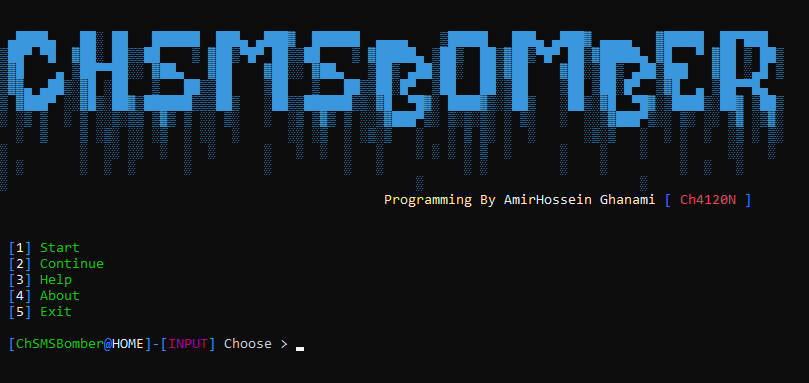
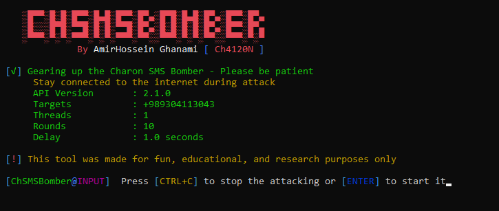
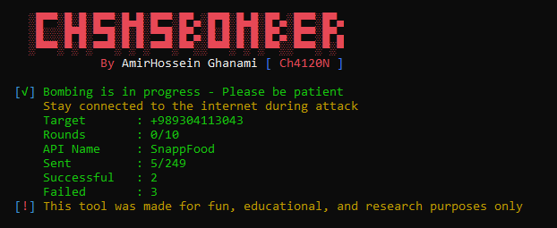

<head>
  <meta name="google-site-verification" content="l4gzIHopgDDt57xRYeRvJZ5DYgg4lLb-qPciUxhNxkY" />
</head>

# Charon SMS Bomber

## Project Programmer
> Ch4120N - Ch4120N@Poroton.me

## Made For
> Attacking To Multiple Phone Numbers With SMS & CALL Spam

## 👀 Screenshot




## ⚓ Requires
> Python3

### Installing Requirement Packages
> python -m pip install -r requirements.txt

## ⚙️ Installation

### For Linux

```bash
sudo apt install python3 git -y
git clone https://github.com/Ch4120N/Charon-SMS-Bomber.git
chmod 755 -R Charon-SMS-Bomber
cd Charon-SMS-Bomber
python -m pip install -r requirements.txt
python chsmsbomber.py
```

### For Termux
```bash
termux-setup-storage
apt install python git -y
git clone https://github.com/Ch4120N/Charon-SMS-Bomber.git
chmod 755 -R Charon-SMS-Bomber
cd Charon-SMS-Bomber
python -m pip install -r requirements.txt
python chsmsbomber.py
```

## Supported Operating Systems
- [X] Debian
- [X] Kali Linux
- [X] Ubuntu
- [X] Arch Linux
- [X] Android (With Termux)
- [X] Windows 7/8/10/11

## ✨ Features
* Multi Target Phone Numbers
* Config Persistence
* Support Multi Processing
* Update Checker
* Good Design
* Very High Speed
* Advanced Error Handling

## ❤️ Donation 
> bitcoin:   bc1ql4syps7qpa3djqrxwht3g66tldyh4j7qsyjkq0

## Licence
* CGBL (Charon General Black Licence)

## 🚨 Reporting Issues

If you are facing a configuration issue or something is not working as you expected to be, please use the **Ch4120N@Poroton.me**

## ⚠️ Legal disclaimer ⚠️

> Usage of `Charon SMS Bomber` for attacking targets without prior mutual consent is illegal. It's the end user's responsibility to obey all applicable local, state and federal laws. Developers assume no liability and are not responsible for any misuse or damage caused by this program.
